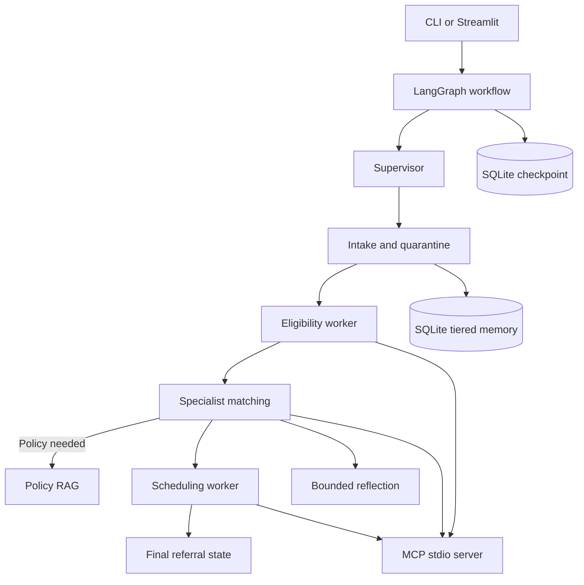

# Referral Management Copilot

A model-backed, multi-agent referral workflow for synthetic healthcare data. It accepts a referral, validates intake, checks coverage, retrieves policy when needed, finds a specialist, schedules an available slot, and records the workflow state.

## Problem

Referral teams must coordinate incomplete clinical information, insurance eligibility, network restrictions, policy requirements, specialist availability, and follow-up. Important context can be lost between workflow steps or sessions, while free-text provider notes can contain untrusted instructions.

## Solution

LangGraph coordinates specialized workers over a typed state object. Gemini or Groq makes live structured decisions when an API key is configured. Local MCP tools provide authoritative synthetic eligibility, network, and availability data. SQLite checkpointing and tiered memory preserve state, while quarantine, bounded retries, policy retrieval, and structured evidence provide control and traceability.



## Prerequisites

- Python 3.11 or newer
- `pip` and `venv`
- GNU Make for the convenience commands
- Docker Engine, only for container usage
- A Gemini or Groq API key for live model calls; without a key, the application uses explicit validated fallbacks

No real patient data, external database, Docker registry, or vendor directory is required.

## Quick Start

```bash
git clone <repository-url>
cd ReferralManagementCopilot
python3 -m venv .venv
source .venv/bin/activate
make install
cp .env.example .env
```

Edit `.env` and set either `LLM_PROVIDER=gemini` with `GEMINI_API_KEY`, or `LLM_PROVIDER=groq` with `GROQ_API_KEY`. The other provider key may remain a placeholder.

Run the full local pipeline:

```bash
make run
```

Run one referral:

```bash
make demo
python scripts/run_demo.py REF-1003
```

Launch the UI:

```bash
make ui
```

Open `http://localhost:8501` when Streamlit starts.

## Environment Variables

| Variable | Required | Purpose |
| --- | --- | --- |
| `LLM_PROVIDER` | No | `gemini` or `groq`; defaults to `gemini` |
| `GEMINI_API_KEY` | For Gemini live calls | Google API key |
| `GEMINI_MODEL` | No | Defaults to `gemini-2.5-flash` |
| `GROQ_API_KEY` | For Groq live calls | Groq API key |
| `GROQ_MODEL` | No | Defaults to `llama-3.3-70b-versatile` |
| `LLM_TEMPERATURE` | No | Model temperature, default `0.0` |
| `LLM_TIMEOUT` | No | API timeout in seconds, default `30` |
| `LLM_API_RETRIES` | No | Provider API retry count, default `3` |
| `REFLECTION_MAX_RETRIES` | No | Referral recovery retry limit, default `3` |
| `CHECKPOINT_DB_PATH` | No | SQLite graph checkpoint path |
| `MEMORY_DB_PATH` | No | SQLite durable memory path |
| `DATA_DIR` | No | Synthetic data and policy directory |
| `EVIDENCE_DIR` | No | JSON evidence output directory |

Copy `.env.example`; never commit `.env` or API keys.

## Docker

Build and run the Streamlit container:

```bash
cp .env.example .env
# Add a provider key to .env for live calls.
make docker-build
make docker-run
```

The image uses Python 3.12, installs the pinned `requirements.txt`, runs as a non-root user, and exposes port 8501. Local `.env`, databases, caches, and `vendor/` are excluded from the build context.

## Tests and Evaluation

```bash
make test
make evaluate
```

`make test` runs the unit and integration suite. `make evaluate` runs the 11-case golden referral benchmark. The expected status contract is stored in `data/golden/golden_set.jsonl`.

To regenerate committed-style evidence artifacts:

```bash
make evidence
```

The complete `make run` sequence validates data, indexes policy documents, runs the benchmark, executes tests, generates evidence, and runs the CLI demo.

## CI/CD

[.gitlab-ci.yml](.gitlab-ci.yml) uses Python 3.12 and the same pinned requirements as local development:

1. `test` validates data and runs pytest.
2. `evaluate` indexes policies, runs the golden benchmark, and runs a demo; evidence is retained as a job artifact.
3. `docker` builds the image for merge requests and the default branch.

CI does not require an API key because the application has an explicit fallback mode. Add protected GitLab variables if a pipeline should exercise live Gemini or Groq calls.

## Project Structure

```text
src/referral_copilot/   Application package: graph, agents, MCP, LLM, memory, RAG
scripts/                 Validation, indexing, evidence, demo, and full pipeline commands
evals/                   Golden benchmark runner
tests/                   Acceptance and non-functional requirement tests
data/                    Synthetic records, policies, and golden inputs
evidence/                Structured execution artifacts
docs/                    Architecture, security, operations, and traceability
auto-generated files     SQLite databases, caches, and Python bytecode; ignored by Git
```

## Design Decisions

- **Supervisor-worker LangGraph:** separates intake, eligibility, matching, scheduling, and reflection while keeping routing explicit.
- **Live structured model calls:** workers use Pydantic schemas through the configured Gemini or Groq provider. Candidate IDs, appointment slots, eligibility, terminal statuses, and retry limits remain constrained by local rules and MCP results.
- **MCP over stdio:** the adapter launches `src/referral_copilot/mcp/server.py` as a separate process. Compatible installations use `langchain-mcp-adapters`; the bundled SDK compatibility path still uses MCP initialization and JSON-RPC.
- **SQLite:** satisfies local checkpointing and cross-session memory without an external database service.
- **Vector policy retrieval:** the matching worker decides when to query a FAISS index built from Sentence-Transformers embeddings of local policy chunks.
- **Synthetic-only scope:** this repository does not connect to EHRs, real schedulers, or production patient systems.

Detailed rationale and operational guidance are in [docs/architecture.md](docs/architecture.md), [docs/deployment-runbook.md](docs/deployment-runbook.md), [docs/traceability-matrix.md](docs/traceability-matrix.md), and [docs/security/](docs/security/).

## License and Data Boundary

This repository is a capstone implementation using synthetic data for development and evaluation. It is not a clinical decision system and does not perform real healthcare transactions.
