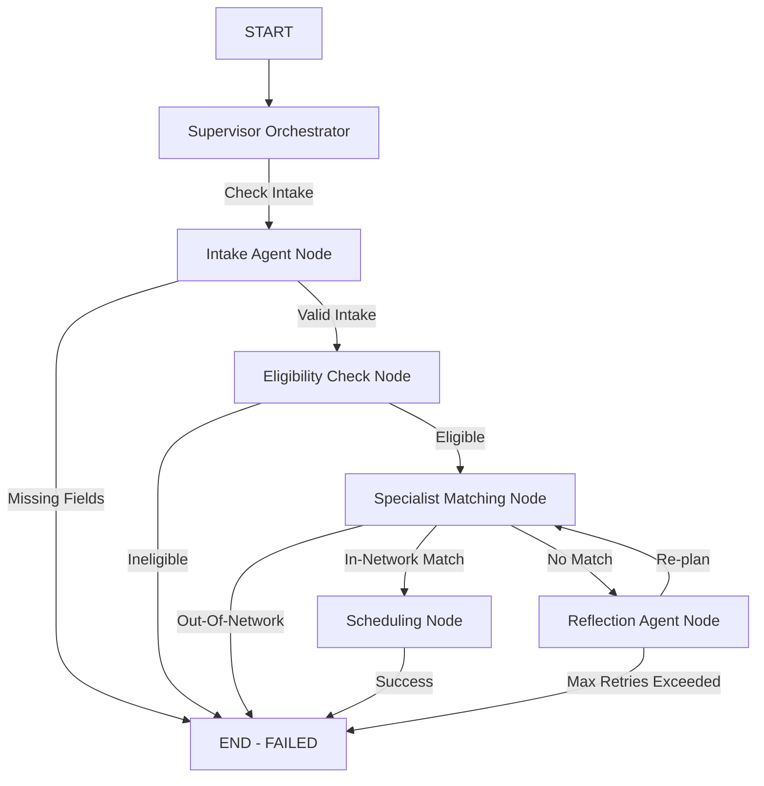

# Architecture Specification: Referral Management Copilot

## 1. Single-vs-Multi-Agent Rationale (NFR-06)
A single monolithic prompt lacks domain isolation and deterministic control across complex healthcare referral workflows.
We chose a **Supervisor-Worker Multi-Agent Architecture** on **LangGraph**:
- **Supervisor Orchestrator**: Evaluates high-level case state and routes execution dynamically.
- **Domain Worker Specialist Nodes**: Separate concerns into discrete, testable nodes (`intake`, `eligibility`, `matching`, `scheduling`, `reflection`).
- **Deterministic Edge Routing**: Enforces hard compliance rules (e.g. immediate rejection on expired insurance coverage, prior-authorization requirement on out-of-network requests) without relying on LLM guesswork.

## 2. System Architecture Diagram

## 3. Live LLM Provider Architecture
- Centralized Provider Factory (`src/referral_copilot/llm/factory.py`) reads `LLM_PROVIDER` from `.env`.
- Dynamic switching between `gemini` (Google Gemini) and `groq` (Groq API) via ONE configuration setting.
- Worker nodes call `llm/runtime.py`, which requests validated Pydantic outputs from the configured provider.
- With no usable key, each node uses an explicit domain-safe fallback and records `llm_mode: fallback`; a configured key always attempts a live call.

## 4. Context Engineering & Security Quarantine (NFR-03, NFR-08)
- **Quarantine**: Untrusted free-text referring provider notes are sanitized and wrapped in an explicit passive XML boundary (`<UNTRUSTED_REFERRING_PROVIDER_NOTE>`) preventing prompt injection attacks.
- **Compression**: Trajectory logs exceeding 5 entries are deterministically compressed to conserve model token quota.

## 5. Tiered Memory & Eviction Policy (AC-06, AC-07, AC-08)
- **Short-Term Memory**: Shared graph state (`ReferralState`).
- **Long-Term Durable Store**: SQLite backed database (`data/memory.db`) storing patient preferences, clinical facts, and historical overrides.
- **Eviction Policy**: Importance-Weighted LRU + TTL. Facts with importance score >= 0.8 are protected from capacity eviction.

## 6. Custom Model Context Protocol (MCP) Server (AC-09, AC-10)
- Built on Python MCP SDK (`mcp.server.fastmcp`).
- Tools: `eligibility_check`, `network_lookup`, `specialist_availability`.
- Resource: `referral-policy://cardiology`.
- Consumed via `MCPClientAdapter` with committed evidence logs.
- The adapter launches `server.py` as a local stdio MCP subprocess. Compatible installations use `langchain-mcp-adapters`; the vendored SDK has a protocol-level fallback so offline execution still uses MCP JSON-RPC rather than direct function imports.
